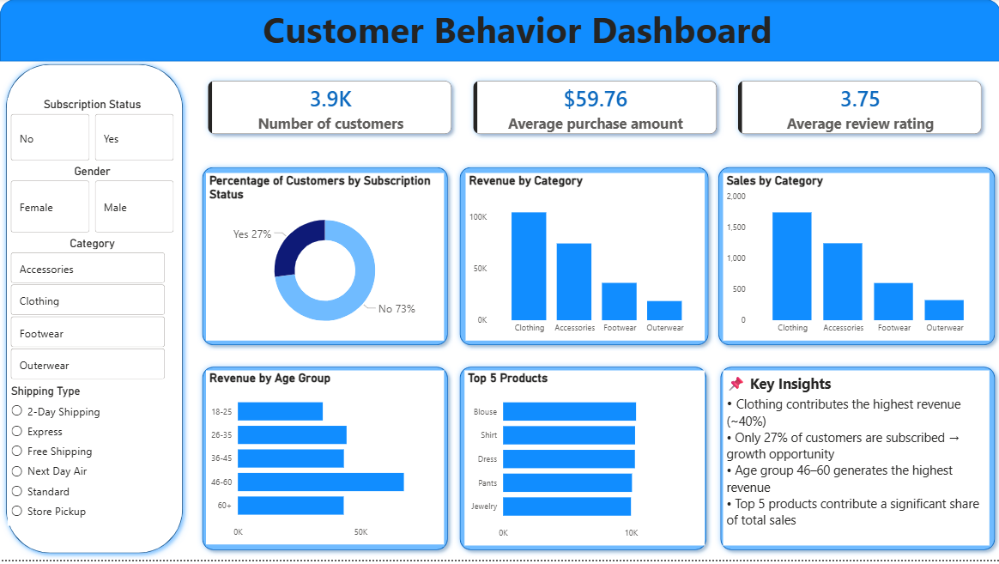

# 🛒 Customer Shopping Behavior Analysis



---

## 📌 Project Overview

This project analyzes **customer shopping behavior** using transactional data (~3,900 records) to uncover insights into **spending patterns, customer segmentation, product preferences, and subscription behavior**.

The goal is to build an **end-to-end data analytics pipeline**:

* 🧹 **Python (Pandas)** → Data cleaning & preprocessing
* 🧠 **MySQL** → Business-driven SQL analysis
* 📊 **Power BI** → Interactive dashboard & visualization

---

## 📊 Dataset Summary

* **Rows:** 3,900
* **Columns:** 18

### 🔑 Key Features:

* **Customer Demographics:** Age, Gender, Location, Subscription Status
* **Purchase Details:** Item Purchased, Category, Purchase Amount (USD), Season
* **Behavioral Data:** Discount Applied, Previous Purchases, Review Rating, Shipping Type

### ⚠️ Data Cleaning:

* Handled missing values in `Review Rating`
* Standardized column names
* Removed redundant column (`promo_code_used`)
* Created **age_group** feature for analysis

---

## 🧹 Data Preprocessing (Python)

* Loaded dataset using **Pandas**
* Performed exploratory analysis (`info()`, `describe()`)
* Imputed missing values using **median (category-wise)**
* Created derived features:

  * `age_group` (18–24, 25–34, etc.)
* Exported cleaned data to **MySQL**

---

## 🧠 SQL Analysis (MySQL)

Executed **15 business-focused SQL queries** to extract insights.

### 🔹 Customer & Revenue Insights

* Revenue generated by **gender**
* Revenue contribution by **age groups (custom bins)**
* Identified **top 10% high-spending customers** *(NTILE window function)*
* Customers using discounts but still spending above average

---

### 🔹 Product & Category Analysis

* Top 5 products by **average review rating**
* Top 3 most purchased products per category *(ROW_NUMBER window function)*
* Products with highest **discount usage percentage**

---

### 🔹 Customer Behavior & Segmentation

* Subscriber vs non-subscriber **spending comparison**
* Repeat buyers (>5 purchases) vs subscription behavior
* Customer segmentation into:

  * New
  * Returning
  * Loyal

---

### 🔹 Operational Insights

* Average purchase comparison between **Standard vs Express shipping**
* Shipping type generating highest **total revenue**
* Impact of discounts on **customer review ratings**

---

## 📈 Power BI Dashboard

An interactive dashboard was created to visualize key metrics and insights.

### 🔑 Key Metrics:

* **Total Customers:** 3.9K
* **Average Purchase Amount:** $59.76
* **Average Review Rating:** 3.75

### 📊 Visualizations:

* Subscription distribution (Donut chart)
* Revenue by category
* Sales by category
* Revenue by age group
* Top 5 products
* Interactive filters:

  * Gender
  * Category
  * Shipping Type

---

## 🔍 Key Insights

* Clothing contributes the **highest revenue (~40%)**
* Only **27% of customers are subscribed** → growth opportunity
* Age group **46–60 generates the highest revenue**
* Top-performing products drive a significant share of sales
* Discounts influence purchasing behavior but not always satisfaction

---

## 💡 Business Recommendations

* 🎯 Increase subscription adoption through targeted offers
* 🔁 Implement loyalty programs for repeat customers
* 💰 Optimize discount strategies to maintain profitability
* 🛍️ Promote high-performing products in marketing campaigns
* 📌 Focus on high-revenue customer segments (46–60 age group)

---

## 🛠️ Tech Stack

* **Python (Pandas, NumPy)** → Data Cleaning & Preprocessing
* **MySQL** → Data Analysis (Window Functions, Aggregations)
* **Power BI** → Dashboard & Data Visualization

---

## 🚀 Project Highlights

* End-to-end **data analytics workflow**
* Strong use of **SQL (including window functions)**
* Clear **business-oriented insights**
* Interactive **dashboard storytelling**

---

## 📁 Project Structure

```
├── data/
├── sql_queries.sql
├── customer_behavior_dashboard.png
├── analysis.ipynb
├── README.md
```

---

## 📬 Contact

Feel free to connect for collaboration or feedback!
